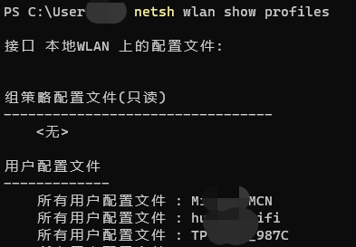
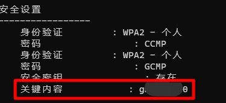
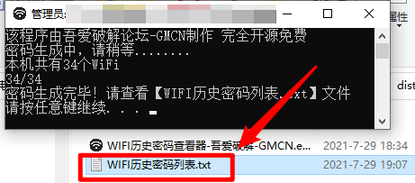
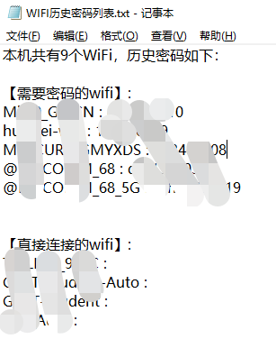

# python WIFI历史密码查看器 WIFI密码查看器

## 原理

win+R，输入cmd打开命令行窗口

```powershell
#这个命令可以列出你所有连接过的wifi
netsh wlan show profiles 
```



```powershell
#替换你要查找的WiFi名称，就可以显示出这个wifi的所有信息，包括密码
netsh wlan show profile name=【Wifi名称】 key=clear
```



```
#实践中发现，用cmd的话，如果有些wifi包含空格，就显示不了。powershell则可以
所有python需要powershell,所以只能在windows上用
```

## 使用说明

目前只测试win10可以正常使用，其他的没有适配，欢迎留言

需要源码的兄弟，下面自取

双击【dist的exe】,会显示一个简单的进度，跑完之后，当前目录会出现一个【WIFI历史密码列表.txt】，里面就是本电脑所有的WiFi密码了

源码安装好相关库后【就1，2个库，就不放requirements.txt了】，运行也是相同的结果





### 有问题可以回复或者去提issue